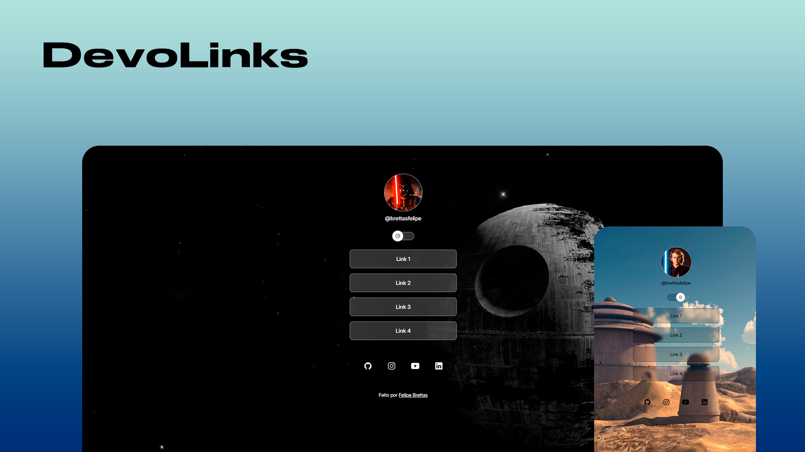

# 🌐 DevoLinks

Uma página simples e personalizável para reunir e compartilhar seus links mais importantes, como portfólio, GitHub, LinkedIn e outros, funcionando como um cartão de visitas online.

## 🚀 Tecnologias

Este projeto foi desenvolvido com:

- **HTML** – Estrutura da página  
- **CSS** – Estilização e responsividade  
- **JavaScript** – Interatividade (modo claro/escuro, entre outros)
- **Git** e **Github**

## 📌 Recursos

✔ Interface simples e responsiva  
✔ Links organizados de forma clara e acessível  
✔ Tema claro/escuro para melhor experiência visual  
✔ Ícones personalizados para cada link  

## 💻 Projeto

Este página é o projeto final do curso **Discover** da **Rocketseat**.

## 🔧 Como usar

1. Clone este repositório:  
   ```sh
   git clone https://github.com/brettasfelipe/devolinks.git